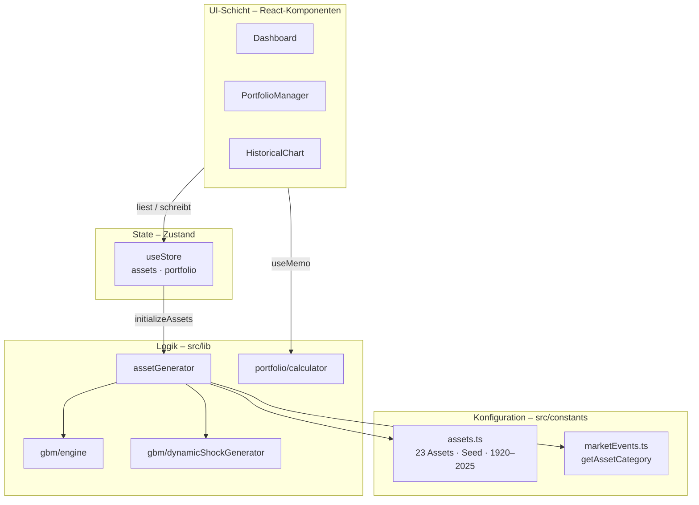
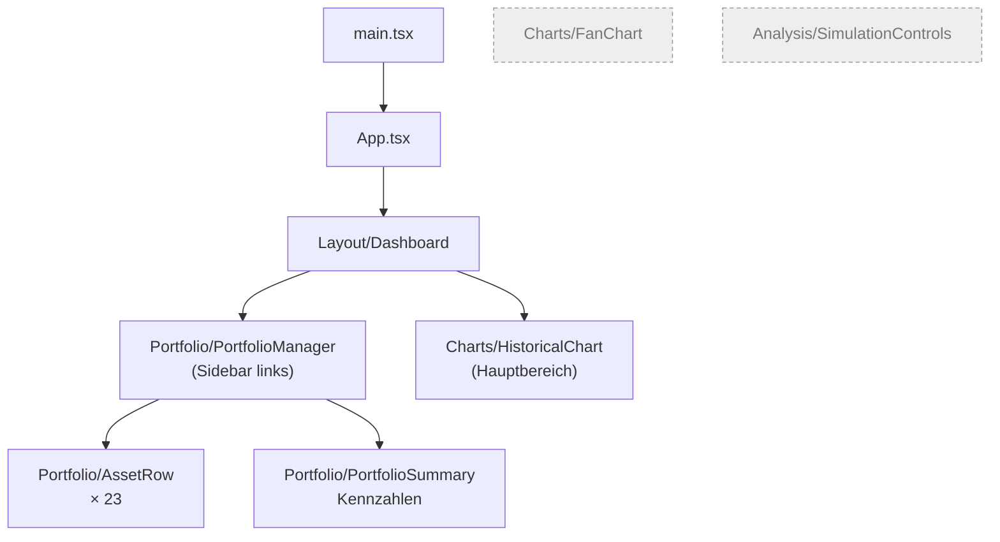
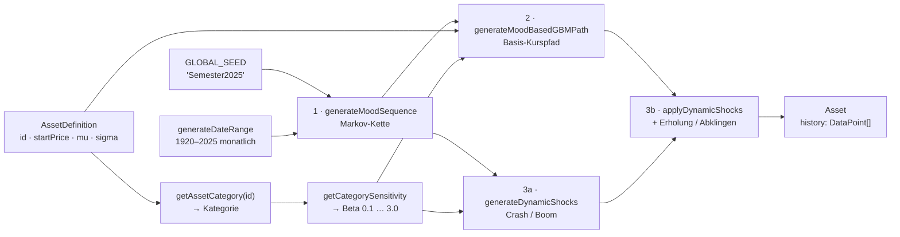
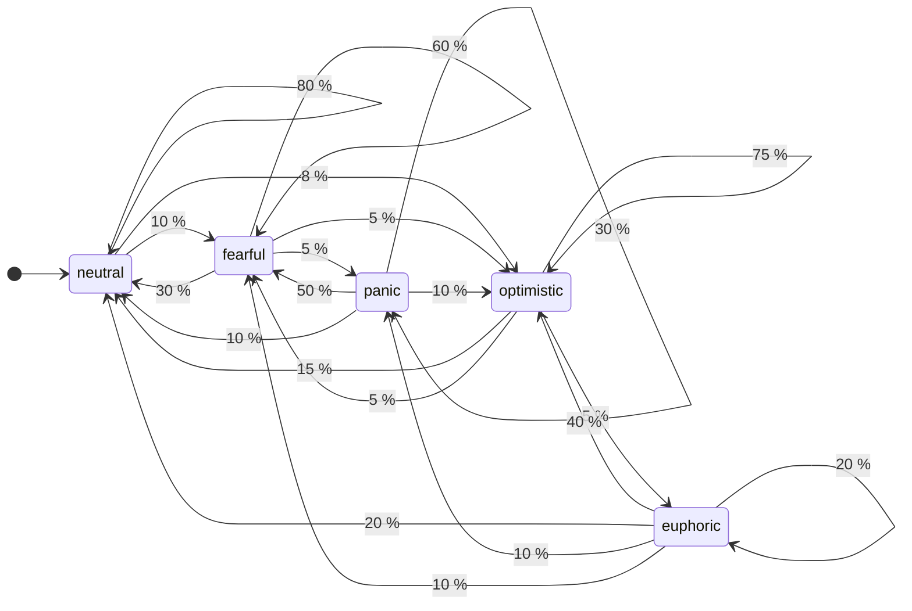
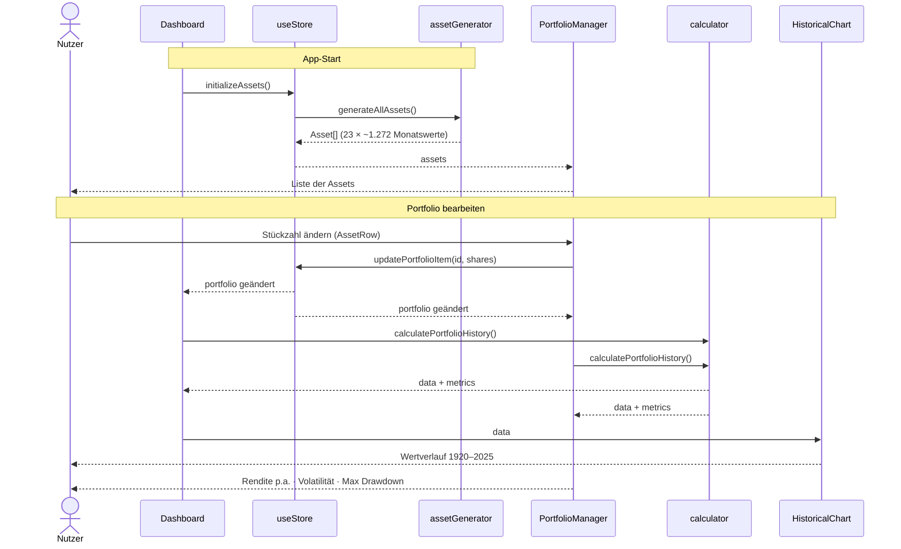
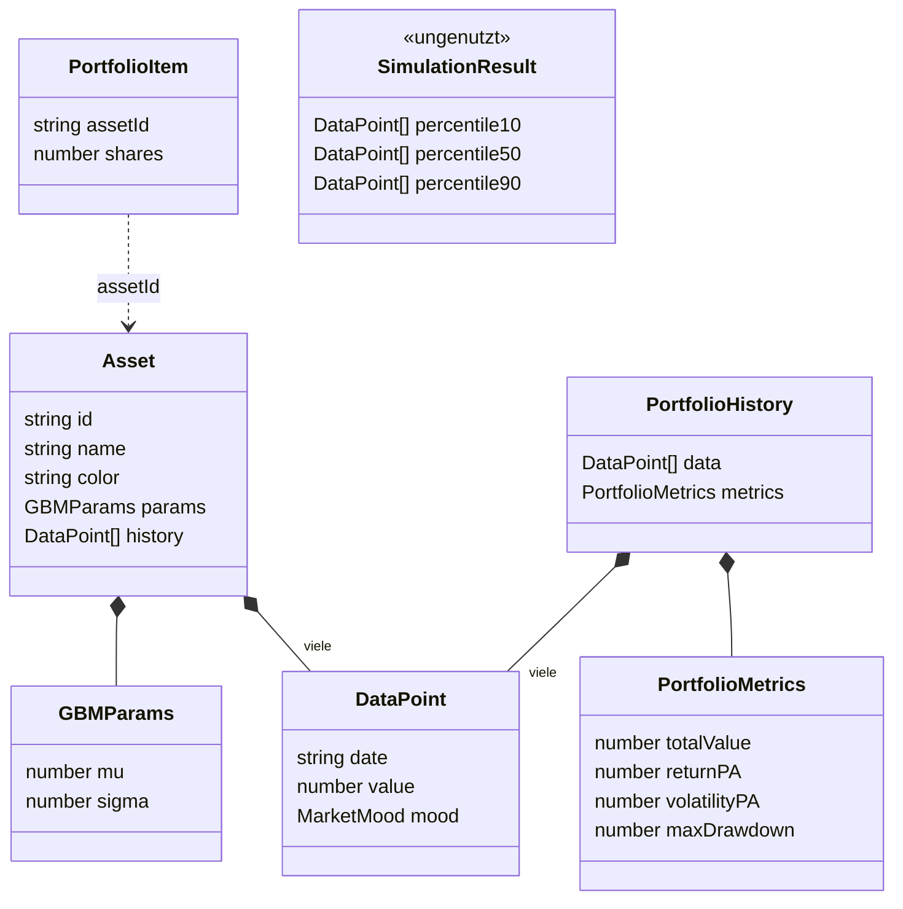

# Finley – Architektur-Diagramme

Die Diagramme sind in [Mermaid](https://mermaid.js.org/) geschrieben. Sie werden auf GitHub automatisch gerendert, in VS Code z. B. mit der Erweiterung „Markdown Preview Mermaid Support".

Zurück zum [Onboarding](ONBOARDING.md).

---

## 1. Schichtenüberblick

Rein clientseitige Single-Page-App, kein Backend.

---

## 2. Komponentenbaum

Grau gestrichelt = im Code vorhanden, aber nicht eingebunden.

---

## 3. Pipeline der Kursdaten-Erzeugung

Wird einmal beim Start in `generateAllAssets()` für **jedes** Asset durchlaufen.

Jeder Schritt bekommt einen eigenen abgeleiteten Seed (`…-moods`, `…-shocks-…`), daher ist das Ergebnis deterministisch.

---

## 4. Marktstimmungen (Markov-Kette)

Übergangswahrscheinlichkeiten pro Monat aus `TRANSITION_MATRIX` in `dynamicShockGenerator.ts` (Übergänge < 5 % weggelassen).

Wirkung der Stimmung auf den Kurs:

| Stimmung   | Drift × | Volatilität × | Schock-Chance / Monat | davon positiv |
| ---------- | ------- | ------------- | --------------------- | ------------- |
| euphoric   | 1.5     | 0.6           | 12 %                  | 85 %          |
| optimistic | 1.2     | 0.9           | 6 %                   | 70 %          |
| neutral    | 1.0     | 1.0           | 3 %                   | 50 %          |
| fearful    | 0.5     | 1.3           | 8 %                   | 35 %          |
| panic      | −1.5    | 2.5           | 20 %                  | 15 %          |

Die Multiplikatoren werden zusätzlich mit der Kategorie-Sensitivität des Assets skaliert.

---

## 5. Ablauf: App-Start und Nutzerinteraktion

Hinweis: `calculatePortfolioHistory()` läuft zweimal – einmal in `Dashboard`, einmal in `PortfolioManager`.

---

## 6. Datenmodell

